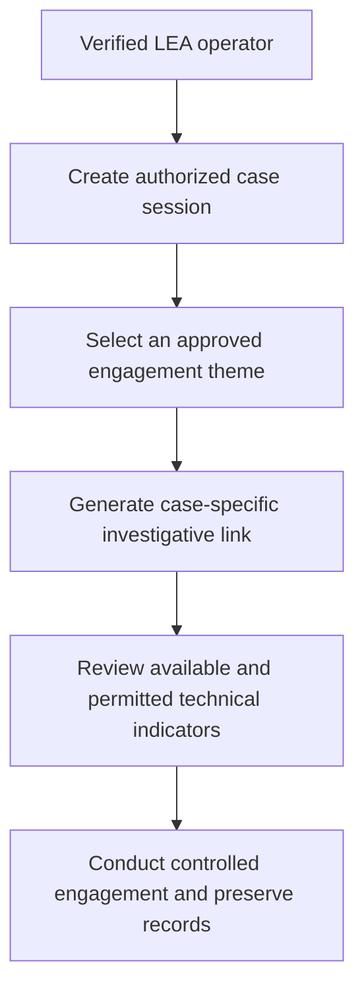

# Warro Tracker Bot

**Warro Tracker Bot** is a Telegram-based OSINT and digital-investigation support platform developed exclusively for verified **Law Enforcement Agency (LEA)** personnel conducting authorized investigations.

Its central capability is a controlled undercover-engagement workflow that allows an authorized investigator to communicate through a case-appropriate fictional persona without exposing the investigator's real identity. The platform also supports themed investigative links, permission-aware technical-data collection, and evidence-oriented interaction records.

> **Public showcase only:** The source code, deployable page templates, infrastructure configuration, operational logic, and sensitive investigation workflows are not publicly uploaded. This repository exists as a professional project showcase and high-level capability overview.

---

## 🎭 Highlighted Capability: Operator-Controlled Undercover Engagement

During an approved undercover or active-OSINT operation, an investigator may need to engage an investigative subject without revealing the officer's real identity.

Warro Tracker Bot provides an **Operator-Controlled Undercover Engagement Module** through which an authorized investigator can:

- Use a case-appropriate fictional male or female decoy persona
- Communicate with an investigative subject through the Telegram-based operator interface
- Maintain separation between the investigator's real identity and operational persona
- Support controlled engagement in cyber-fraud, romance-scam, escort-scam, extortion, online-exploitation, and organized digital-crime investigations
- Maintain relevant interaction records for authorized case analysis and evidence handling

The module is **human-controlled**: the authorized investigator remains responsible for every message, decision, and action. It is not intended for autonomous impersonation, personal use, harassment, or the impersonation of a real uninvolved person.

---

## 🚀 Project Overview

Cybercrime investigations often involve online subjects who hide behind false profiles, anonymous accounts, temporary numbers, or fabricated identities. Developing an actionable technical lead can require controlled engagement alongside conventional OSINT and legal investigative procedures.

Warro Tracker Bot brings these workflows into one Telegram-based interface. It can help an authorized investigator create a case-specific engagement session, generate an approved contextual link, review available technical indicators, and communicate through a controlled operational persona.

The project is designed for:

- Authorized cybercrime investigation support
- Lawful active-OSINT operations
- Approved undercover online engagement
- Cyber-fraud and organized digital-crime investigations
- Evidence-oriented technical lead development
- Trained and verified LEA personnel

---

## 🔍 Key Features

- 🎭 Operator-controlled fictional male or female decoy personas
- 💬 Telegram-based investigator-to-subject communication workflow
- 🔗 Case-specific investigative link generation
- 🎉 Festival and special-occasion themes
- 🌐 General-purpose and context-specific landing pages
- 🕵️ Contextual pages for authorized escort-scam or similar investigations
- 🌍 IP and basic network-information capture
- 🖥️ Browser, operating-system, and user-agent identification
- 📐 Screen-size and display-information capture
- 🔋 Battery information when exposed by the browser and device
- 📍 GPS collection only when browser permission is granted
- 📷 Camera capture only when browser permission is granted
- 🕒 Timestamped session and interaction information
- 🔐 Restricted, LEA-only intended access

> Browser and device capabilities vary. The platform does not bypass operating-system, browser, camera, or location permission controls.

---

## 🧠 What the Bot Does

At a high level, Warro Tracker Bot can support the following authorized workflow:

The platform may help investigators identify or document:

- The public IP address associated with an interaction
- Basic browser, operating-system, and device indicators
- User-agent and screen-size information
- Battery information when technically available
- Interaction date and time
- Permission-based GPS information
- Permission-based camera evidence
- Relevant communication conducted through the controlled decoy persona

These indicators are investigative leads and must be independently assessed, lawfully corroborated, and handled according to applicable evidence procedures.

---

## 📊 Information Categories

| Category | Information potentially available |
| --- | --- |
| Network | Public IP address and basic network indicators |
| Browser | Browser type, operating-system indicators, and user agent |
| Display | Screen size and related display information |
| Device signals | Battery or other browser-exposed signals, when supported |
| Location | GPS coordinates only after browser permission |
| Camera | Image capture only after browser permission |
| Interaction | Session events, timestamps, and authorized engagement records |

Availability and accuracy depend on the visitor's browser, device, settings, network environment, and granted permissions.

---

## 🧩 Investigative Themes

The bot can generate contextual landing pages for different authorized scenarios, including:

- Normal or general-purpose themes
- Festival-themed pages
- Birthday and special-occasion themes
- Case-specific male or female persona themes
- Escort-service-themed pages for sanctioned investigations involving escort scams, extortion, trafficking, exploitation, or connected cybercrime

Themes are intended to provide case context during approved operations. They must not be used to obtain passwords, payment credentials, OTPs, private content, or other information without lawful authority.

---

## 🏗️ High-Level Architecture

The project's non-sensitive workflow is built around:

- **Telegram Bot interface** for the authorized operator
- **Investigative landing-page layer** for approved contextual themes
- **Operator-controlled engagement module** for fictional operational personas
- **Permission-aware browser signals** for supported technical indicators
- **Backend event-processing workflow** for investigation-relevant records
- **Evidence-oriented review workflow** for authorized case use

Implementation details, hosting architecture, page templates, security controls, and deployment procedures are intentionally excluded from this public repository.

---

## 🖼️ Screenshots and Demonstration Material

Only sanitized or synthetic demonstration material should be published here, such as:

- Bot interface screenshots with identifying information removed
- LEA verification or access screen
- Theme-selection interface
- Synthetic technical-indicator results
- Blurred or simulated GPS/map output
- Operator-controlled engagement interface using fictional data
- High-level workflow diagram

Real case data, live IP addresses, exact GPS coordinates, faces, conversations, phone numbers, account identifiers, access credentials, and operational infrastructure details must not be uploaded.

---

## 🔐 Why the Source Code Is Private

The source code is private because the project involves sensitive investigative workflows and capabilities that could be misused if distributed without controls.

This repository is maintained only to demonstrate:

- Telegram bot development
- Backend workflow automation
- OSINT and cybercrime-investigation domain knowledge
- Permission-aware browser-data handling
- Controlled undercover-engagement workflow design
- Evidence-oriented information processing
- Security-conscious product design
- Understanding of legal and ethical operational boundaries

The following are not publicly provided:

- Source code or executable packages
- Deployable investigative-page templates
- Infrastructure or server configuration
- Authentication or access-control logic
- Techniques for bypassing browser or device permissions
- Operational playbooks or targeting instructions
- Real investigation records or collected data

---

## 🛡️ Access and Responsible Use

Warro Tracker Bot is intended exclusively for verified LEA personnel acting within an officially assigned matter and under the legal, judicial, or departmental authorization required in the relevant jurisdiction.

Authorized operators are responsible for:

- Confirming the legal basis and operational approval before use
- Limiting collection to information relevant and proportionate to the case
- Following departmental policy and applicable privacy, surveillance, and evidence laws
- Protecting collected information against unauthorized access or disclosure
- Maintaining appropriate case records and chain-of-custody procedures
- Discontinuing activity when authority expires or the investigative purpose ends

---

## ⚖️ Legal and Ethical Disclaimer

This project must not be used for:

- Personal surveillance or private disputes
- Stalking, harassment, intimidation, or blackmail
- Unauthorized tracking or privacy invasion
- Credential harvesting, OTP collection, or payment fraud
- Impersonating a real uninvolved person
- Capturing a camera image or GPS location by bypassing permission controls
- Any operation lacking the required legal and departmental authorization

The repository does not grant legal authority to use the platform. Every deployment and investigative action remains subject to applicable law, official approval, agency policy, necessity, proportionality, data-protection requirements, and evidentiary procedure.

---

## 📌 Repository Scope

This public repository may contain:

- Project documentation
- High-level feature descriptions
- Sanitized screenshots
- Synthetic demonstrations
- Non-sensitive workflow diagrams
- Project updates and changelog information

It does **not** contain source code or operationally sensitive material.

---

## 📌 Project Status

| Field | Details |
| --- | --- |
| **Status** | Active |
| **Project Type** | Telegram Bot and investigative web workflow |
| **Domain** | OSINT / Cybercrime Investigation / Digital Forensics |
| **Intended Users** | Verified Law Enforcement Agency personnel only |
| **Code Availability** | Private |
| **Repository Purpose** | Professional project showcase |
| **Telegram Bot** | [@WarroTrackerBot](https://t.me/WarroTrackerBot) |

---

## 👨‍💻 About This Project

Warro Tracker Bot was developed to address a real investigative challenge: engaging online subjects and developing technical leads without unnecessarily exposing the investigator's personal identity.

The project combines Telegram-based operator controls, contextual investigative pages, permission-aware technical indicators, and controlled persona-based engagement in a single workflow intended for authorized law-enforcement use.

---

## 📬 Contact

For professional discussion, portfolio evaluation, authorized LEA access inquiries, or responsible security reporting, please contact the repository owner through the [Rishi-Warro GitHub profile](https://github.com/Rishi-Warro).

Please do not publish sensitive case information, live operational details, vulnerabilities, or access requests in a public GitHub issue.

